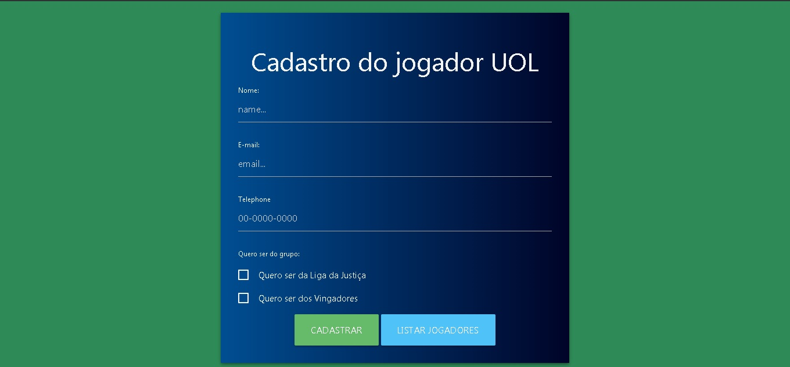
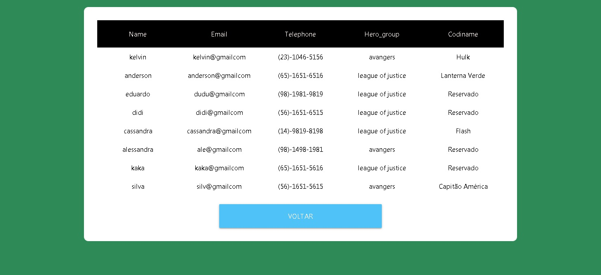

# uol-host-challenge

Teste para BackEnd para UOL HOST

Projeto realizado utilizando node js, templete engine do express e mysq
 
Parte do desafio é ler arquivos xml e json localmentee não guardar as informações do codinome localmente, como classe ou banco de dados
 
O projeto consiste em adicionar um cadastro ao banco de dados, o usuario escolhe o grupo e é adicionado automaticamente, se tiver um nome para ele com base nos herois de cada grupo, cada codiname é unico, sendo assim, não pode repetir, se todos já tiverem sido escolhidos é adicionado o nome de reservado na hora do cadastro, também é possivel listar todos os cadastros  

Para rodar o projeto basta baixar o arquivo, e instalar as dependencias, com o terminal dentro da pasta digite yarn dev e o projeto inciará 

